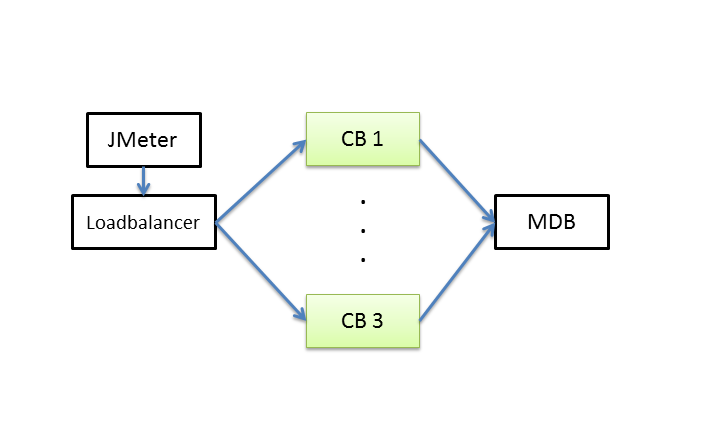
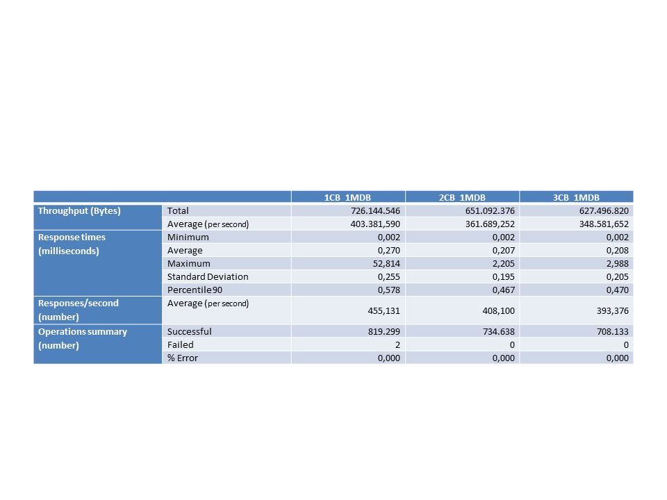
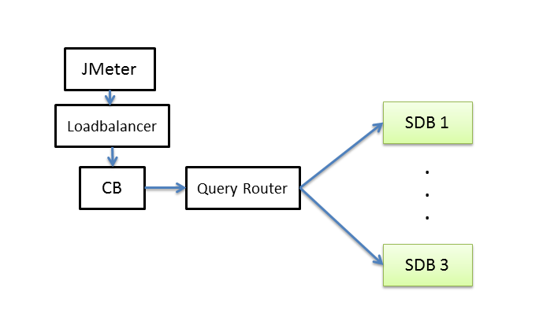
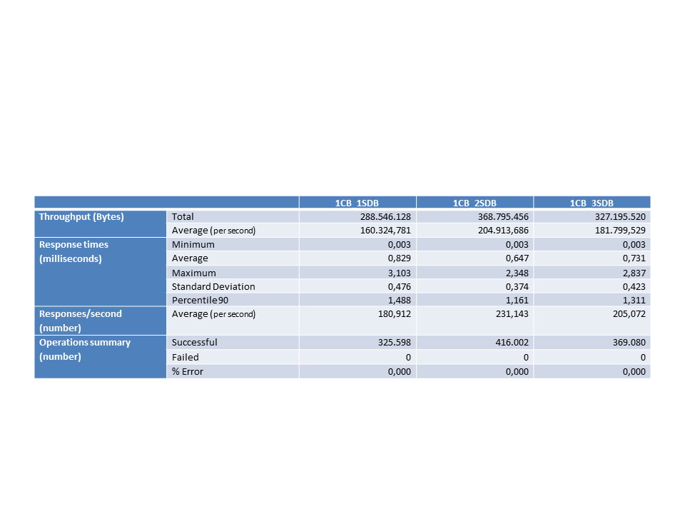
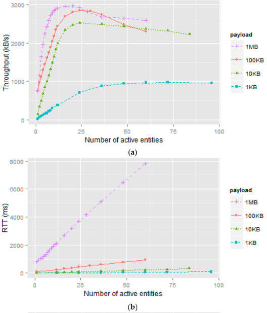

Performance and Scalability consideration
===========================================================

In order to better understand how to deploy Orion in production, we report here the results of non functional tests performed by the FIWARE QA team and by other independent research groups.

* [Stress Test](#stress-test)
* [Scalability Test](#scalability-test)
* [Latency Test](#latency)

# Stress test

This is an overview of the stress test performed by the FIWARE QA team.  A test environment was configured for the execution of the tests, consisting of two physical machines with the same configuration: one for the deployment of Orion Context Broker (Version 1.6.0) and its related database and another one for client test and monitoring applications.

         CPU: 1 Intel(R) Xeon(R) E31230 
         CPU-GHz: 3.20
         Core: 4 cores and 8 threads
         RAM: 4GB DIMM DDR3 Synchronous 1333 MHz
         Cache: 128KB L1, 1MB L2, 8MB L3
         Hard-Disk: 128GB
         Operating-System: CentOS release 6.7 - 64 bits
         NICs: 2 interfaces 82574L Gigabit Network Connection

The executed performance tests are composed by nine scenarios:

1.  [Update Stress Scenario 20 attributes](#scenario-1:-update-stress-scenario-20-attributes)
2.  [Update Stress Scenario 6 attributes](#scenario-2:-update-stress-scenario-6-attributes)
3.  [Convenience Update Stress Scenario](#scenario-3:-convenience-update-stress)
4.  [NGSIv2 Update Stress Scenario](#scenario-4:-ngsiv2-update-stress)
5.  [Update Stress with notifications](#scenario-5:-update-stress-with-notifications)
6.  [NGSIv2 Update Stress with notifications](#scenario-6:-ngsiv2-update-stress-with-notifications)
7.  [Stability Scenario](#scenario-7:-stability-scenario)
8.  [Optimized Stability Scenario](#scenario-8:-optimized-stability-scenario)
9.  [No-cache Optimized Stability Scenario](#scenario-9:-no-cache-optimized-stability-scenario)

Scenarios 1, 2, 3 and 6 foresee to add a thread every six seconds to reach 300 for the Context Broker Update service. 
A data set of 5000 entities was updated to  a number of attributes ranging from 1 to 20. The scenario stops 10 minutes after the 300 concurrent threads are reached. At the beginning of the execution of this scenario  the subscriptions necessary to perform the tests are already in place.

Scenarios 4 and 5 are updated scenarios using NGSIv2 APIs instead of NGSIv1 ones. Scenario 2 is the same than scenario 1, but the number of attributes is lower in order to compare the results with scenario 2 (NGSIv1 vs NGSIv2).

Scenarios 4 and 5 are the same than scenarios 1 and 3, but a previous load of 1000 subscriptions has been launched over the database, in order to  generate notifications by Orion.

In Scenario 7 (Stability scenario), 3 thread (one per each tested service) every six seconds were added to reach 30:

-   1 for the Context Broker Subscription service,
-   1 for the Context Broker Update service and
-   1 for the Context Broker Convenience Update service.

The scenario 7 stops after 10 hours. The goal of this scenario is to check whether the system is degraded with a moderate load for a long period of time.

Scenario 8 is the same than scenario 6, with the [optimizations recommended by Orion’s developers](perf_tuning.md), as follows:

1 - Added the next parameters to Orion startup:

        -reqMutexPolicy none -writeConcern 0 -logLevel ERROR -notificationMode threadpool:1500:150

2 - Created four indexes over the entities collection in the database:

        db.entities.createIndex( { "_id.id": 1 } )
        db.entities.createIndex( { "_id.type": 1 } )
        db.entities.createIndex( { "_id.servicePath": 1 } )
        db.entities.createIndex( { "attrNames": 1 } )

Finally scenario 9 is the same than scenario 8, previously disabling the cache using the command line option -noCache.

The obtained results were:

[Top](#top)

## Scenario 1: Update Stress Scenario 20 attributes

From Update Stress Scenario (1-20 attributes), we can get:

-   Orion can handle near 514 update request per second, updating 1-20 attributes in each request.
-   In these conditions, response time is about 0.363 second.
-   The throughput is about 861 KBytes/sec
-   Reliability is 100% (there were no errors).
-   The CPU and memory usage is stable.

[Top](#top)

## Scenario 2: Update Stress Scenario 6 attributes

From Update Stress Scenario (1-6 attributes), we can get:

-   Orion can handle near 700 update request per second, updating 1-6 attributes in each request.
-   In these conditions, average response time is about 267 milliseconds.
-   The throughput is about 660 KBytes/sec
-   The performance of the update requests is less proportional to the number of attributes updated in it (updating more attributes in a request is now better).
-   Reliability is 100% (there were no errors).
-   The CPU and memory usage is stable.

[Top](#top)

## Scenario 3: Convenience Update Stress

From Convenience Update Stress Scenario, we can get:

-   Orion can handle about 183 convenience update requests per second, updating 1-20 attributes in each request.
-   In these conditions, response time is about 1 second.
-   The throughput is about 275 KBytes/sec
-   Reliability is 100% (there were no errors).
-   The CPU and memory usage is stable.

[Top](#top)

## Scenario 4: NGSIv2 Update Stress

From NGSIv2 Update Stress Scenario, we can get:

-   Orion can handle about 500 update requests per second, updating 1-6 attributes in each request.
-   In these conditions, response time is about 373 milliseconds.
-   The throughput was 82KB/s, which is about the 10% of NGSIv1 case’s throughput.
-   Reliability is 100% (there were no errors).
-   The CPU and memory usages are stable.

Response time is 75% higher, and the requests per second rate is 43% lower. We can conclude that NGSIv1 case can handle a higher data volume than NGSIv2, but the network usage is much higher (lower performance), then NGSIv1 has better data handling performance, but lower network usage performance.

[Top](#top)

## Scenario 5: Update Stress with notifications

From Update Stress with notifications, we can get:

-   Orion can handle almost 304 update requests per second, updating 1-6 attributes in each request.
-   In these conditions, average response time is about 617 milliseconds.
-   The request per second rate is about a 27 lower due to the notifications generation. The average response time is about 35% higher.
-   Reliability is 100% (there were no errors).
-   17523 notifications were generated and sent.
-   The CPU and memory usages are stable.

[Top](#top)

## Scenario 6: NGSIv2 Update Stress with notifications

From NGSIv2 Update Stress with notifications Scenario, we can get:

-   Orion can handle about 170 update requests per second, updating 1-6 attributes in each request, which is 60% lower due to the notifications generation.
-   111063 notifications were generated and sent.
-   In these conditions, response time is about 1,110 milliseconds.
-   The throughput was 27KB/s, which is 60% lower than the case without notifications. Response time is about 50% higher.
-   Reliability is 100% (there were no errors).
-   The CPU and memory usages are stable.

[Top](#top)

## Scenario 7: Stability Scenario

From Stability Scenario, we can get:

-   With 30 threads, 10 for each operation, Orion handles around 6 requests per second.
-   In these conditions, average response time is similar for the three operations (around 4,9 seconds).
-   Reliability is 100% (there were no errors).
-   The CPU usage is stable, but the memory usage increases in the time. The system ran out of memory, but it didn’t fall.

[Top](#top)

## Scenario 8: Optimized Stability Scenario

From Optimized Stability Scenario, we can get:

-   With 30 threads, 10 for each operation, Orion handles around 27,7 requests per second.
-   In these conditions, average response time is around 0,483 seconds for subscriptions, 3,173 for convenience updates and 2,340 for updates.
-   It can handle about 361% more requests than without the optimizations.
- The CPU usage is stable, but the memory usage increases in the time, as it happened without optimizations. The system ran out of memory due to the higher load handling and went down after 3 hours.

[Top](#top)

## Scenario 9: No-cache Optimized Stability Scenario

From no-Cache Optimized Stability Scenario, we can get:

-   With 30 threads, 10 for each operation, Orion handles around 9 requests per second.
-   In these conditions, average response time is around 0,015 seconds for subscriptions, 22,541 for convenience updates and 23,630 for updates.
-   The performance is much worse. Now it can handle about a third of requests than with the cache enabled, and the response time is extremely high for updates and convenience updates operations.
-   The memory management problem doesn’t appear in this case, and the memory usage keeps stable along all the test.

[Top](#top)

# Scalability Test

The scalability tests performed for the Orion Context Broker concerning the most important functionality: the attribute updating.
In order to measure the scalability of Context Broker two types of scenarios has been executed:

1.  [Context Broker nodes horizontal scaling](#context-broker-nodes-horizontal-scaling); these tests were executed gradually increasing the number of CB nodes

2.  [MongoDB shards horizontal scaling](#mongodb-shards-horizontal-scaling); these tests were executed gradually increasing the number of MongoDB shards

[Top](#top)

## Context Broker nodes horizontal scaling

In this scenario, a single MongoDB node has been used  increasing the CB number of nodes gradually. Each node is in a separate virtual machine. It also has an Apache Balancer on a separate node. The following diagram shows the sample tested. infrastructure.

Below you can see the results came out for the three configurations obtained by adding a Context Broker at a time. We can see that there is no increase in throughput, but only a slight improvement in response time. 

[Top](#top)

## MongoDB shards horizontal scaling

In this scenario, a single Orion Context Broker node has been used, increasing the number of MongoDB shards (from 1 to 3). Each node is in a separate virtual machine.  The following diagram shows the sample tested infrastructure.

In the following table you can see the results obtained for the three configurations came out by adding a MongoDB shard at a time. The results show clearly that the configuration, that achieves higher performance, is 1CB_2SDB scenario. It is clear that adding the third MongoDB shard performance worsens.

[Top](#top)

# Latency 

In order to investigate the latency using Orion under real usage conditions, this section summarizes a study carried out by the Universidad Politécnica de Cartagena. [Here](http://www.mdpi.com/1424-8220/16/11/1979/html?share=email&nb=1) you can find the complete document.  

[Top](#top)

## Experimentation Environment

The experimentation environment is hosted by a community account in the FIWARE Lab cloud infrastructure enabling the deployment of a virtual machine (VM) hosting an instance of Orion Context Broker (version 1.2.1), version 3.0.12 of a MongoDB database and version 0.13.0 of the Cygnus-NGSI injector. The VM has the following characteristics:
        
        CPU: 4 (Virtual)
        RAM: 8 GB  
        Disk: 80GB 

This more than meets the hardware requirements of Orion and Cygnus-NGSI. 

Physical machines with the same characteristics was used for the clients in the tests:

        Hardware: HP Compaq Business Desktop dc7700p
        CPU: Intel Core 2 Duo E6600/2.4 GHz Dual-Core processor
        Cache: 4 MB cache per core L2 cache 4 MB
        RAM: 2GB
        OS: Windows 7 Home Premium operating system
        Dev: Luna Eclipse development environment SR2 (4.4.2) and context generator application.

From a performance point of view, FIWARE tuning recommendations were taken into account to refine the following testbed components: MongoDB;  Orion and Cygnus-NGSI. The most important aspects of configuration are as follows:

Firstly, version 3.0.12 of MongoDB was used, recommended for intensive update scenarios. In addition, the adjustments limiting use to deployed VM resources were checked and Transparent Huge Pages were disabled (THP).

Secondly, Orion parameters were adjusted for scenarios with high update/notification rates

        -reqPoolSize, -dbPoolSize and -notificationMode  threadPool:q:n
        
These parameters were adjusted for each test.

Lastly,Cygnus-NGSI components were adjusted to increase performance and avoid potential bottlenecks in order to properly assess Orion. 
To achieve this an HTTP source was selected where the OrionRestHandler was configured to convert NGSI events from Orion into Flume events. 
Memory Channel because of its performance was chosen. This type of channel is ideal for flows that require increased performance and are willing to lose data in the case of Flume agent errors. Finally, an Orion HDFS Sink was used. Its performance was enhanced by using the batching mechanism to reduce the number of writes in the HDFS storage. 
[Top](#top)

## Context Generation Methods
The client application developed permits two ways of generating NGSI traffic. The first method (blocking method) simulates intermediate IoT node NGSI traffic generation. Its implementation is supported by the java.net API and its functionality is based on the HttpURLConnection class. This class only allows blocking connections. Thus, in each simulation the same number of persistent HTTP connections as simulated IoT nodes are opened.
The second method (non-blocking method) simulates final IoT node NGSI traffic generation. Its implementation is focused on mechanisms that allow concurrent traffic generation. In this case, the SocketChannel class of the java.nio API was used to create non-blocking connections. Therefore, in each simulation the same number of connections as NGSI requests generated are opened.
Another implementation detail to keep in mind is that each NGSI client (blocking or not) simulates the behaviour of a virtual IoT node in a separate thread.

[Top](#top)

## Test Strategy

Considering the payload of the updateContext requests sent to Orion, four types of tests were run (1 kB, 10 kB, 100 kB and 1 MB). Each of these tests is divided into two categories depending on the context generation method used (blocking or non-blocking). The first category includes performance tests employing the blocking method to measure throughput parameters (expressed in requests per second or kilobytes per second) and round-trip time (in milliseconds). The second category includes performance tests employing the non-blocking method to measure the throughput parameter (expressed in requests per second or kilobytes per second). 20 simulations were launched per category on different days and in different time slots. The test plan, therefore, involves more than 400 simulations. The following section shows the representative results of each type of test.
The following procedure was followed in the tests. The IoT nodes are modelled by threads associated with processes. In the initial simulations, we started with 12 single-threaded processes, each executed on a different machine. When the number of IoT nodes exceeds 12, new threads are started in the processes. To simplify testing, multiples of the number of processes started for the tests are simulated, generally 12, in order to equitably distribute the simulation load among the processes. In certain cases, to refine the results, we worked with fewer machines and therefore fewer processes (always one process per machine). That is why the graphs show measurements with a number of nodes that is not a multiple of 12. A simulation concludes when each virtual IoT node has tried to send 200 requests to the Orion Context Broker. The throughput and round-trip time values of the simulation are calculated from the average of the 200 measurements obtained.

[Top](#top)

## Results

To study the behavior of the Orion RESTful server numerous simulations were made. The realization of these simulations was a very time-demanding task due to network latency. The results obtained  do offer a realistic view of the performance of this Generic Enabler under different deployments and load conditions.

illustrates the results obtained when using the blocking method to generate the context requests for each payload established in the test plan (1 kB, 10 kB, 100 kB and 1 MB). 

A new message is sent as soon as the previous one has been completely delivered. Latency is expressed as Round-Trip Time (RTT) measured in milliseconds (ms) versus number of NGSI clients, which can be sensors (edge devices in general) or intermediate nodes. Simulations results will be interpreted differently depending on whether the active entities are sensors or intermediate nodes. 

 The graphs show that Orion has an initial range (close to linear) where throughput increases at a more or less linear rate and RTT remains constant or linear. 
 
 
 
 After this range, the above parameters tend to increase RTT (waiting time) and decrease throughput (requests processed). 

Analysing the results from the throughput/RTT perspective

* The highest rate of data transfer was 2963 kB/s obtained when simulating a payload of 1 MB and 20 NGSI clients. RTT in this simulation is 3200 ms .
* The second best result was 2846 kB/s obtained when simulating a payload of 100 kB and 24 NGSI clients. However, RTT was 430 ms, clearly much lower than the preceding case.
* The next throughput measurement in descending order was 2520 kB/s corresponding to the simulated payload of 10 kB and 24 NGSI clients. Although the same number of active entities as in the previous case was used, RTT was lower (83 ms).
* Finally, the lowest data transfer rate (978 kB/s) was obtained with the simulation of a payload of 1 kB and 72 NGSI clients. We should note that a much higher number of active entities was needed in comparison with the other simulations. Also, RTT (72 ms) is the lowest value of the cases included in this analysis.

In other words, the system performs better in term of throughput when faced with high loads generated by few nodes. 
The increase in the number of nodes causes a very sharp decrease in the volume of data that can be transferred. Low latency constraints can be easily satisfied in those situations, where there are many clients updating the context with small loads. 
